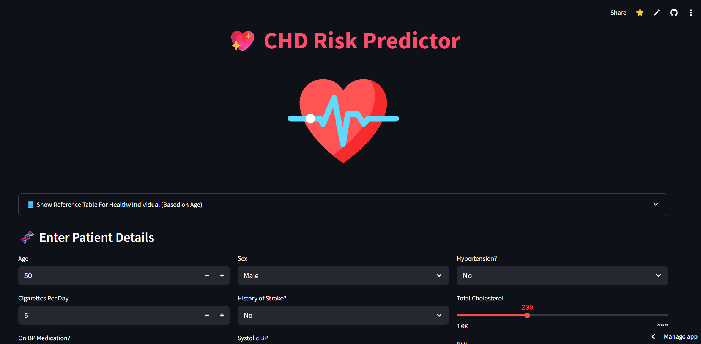

# 💖 CHD Risk Predictor Web App

This is a **machine learning-powered web application** built using **Streamlit** that predicts the **10-year risk of developing Coronary Heart Disease (CHD)** based on an individual's medical and lifestyle data. 

The app uses two advanced models:
- A **hypertuned Random Forest classifier**
- A **Stacking Ensemble Classifier** (Random Forest + Logistic Regression)

Both models are trained on the **Framingham Heart Study dataset**, a globally recognized dataset in cardiovascular risk research.

---

## 🚀 Features

- 🔍 Predict CHD risk based on clinical input (age, cholesterol, BP, etc.)
- 🤖 View probabilities from two different models: Random Forest and Stacking Classifier
- 📊 Interactive gauge charts with **color-coded risk levels**
- 📘 Reference table for healthy biomarker values (age-wise)
- 📌 Explanation section to understand how prediction works (no AI black box!)
- 💅 Stylish layout with Lottie animations and responsive UI

---

## 📦 Technologies Used

- **Frontend**: Streamlit, HTML/CSS for custom UI
- **Backend Models**: Scikit-learn (Random Forest + Logistic Regression + StackingClassifier)
- **Visualization**: Plotly (Gauge Charts)
- **Deployment Ready**: Built to run on Streamlit Cloud or local server

---

## 🧠 How the Models Work

- **Random Forest**: A collection of decision trees working together to produce stable, robust predictions.
- **Stacking Classifier**: Combines Random Forest and Logistic Regression, using their outputs as input to a meta-learner to improve final predictions.

### ✅ Why Ensemble Models?
> Because heart disease prediction is complex and noisy. Stacking helps improve performance by learning from multiple models.

---

## 📋 Input Fields

| Field | Description |
|-------|-------------|
| Age | Patient's age |
| Sex | Male/Female |
| Cigarettes Per Day | Daily smoking habits |
| On BP Medication | Whether patient takes blood pressure meds |
| Stroke History | History of stroke |
| Hypertension | Presence of high blood pressure |
| Diabetes | Diabetic status |
| Total Cholesterol | mg/dL |
| Systolic BP | mmHg |
| Diastolic BP | mmHg |
| BMI | Body Mass Index |
| Glucose | Fasting blood sugar level |

---

## 📈 Output

You get two **CHD risk probabilities**:
- 🔹 From Random Forest
- 🔸 From Stacking Classifier

Each is shown with an animated **gauge meter**:
- 🟢 Low risk (0-40%)
- 🟡 Moderate risk (40–70%)
- 🔴 High risk (70–100%)

---

## 🧪 Example Screenshot

>   


---

## 💡 Understanding the Predictions

Even with high risk factors, the model gives **probabilities** — not a diagnosis.

> “A 75% CHD risk means that, based on similar historical cases, 75 out of 100 people with similar metrics developed CHD within 10 years.”

That’s why this model gives **balanced, calibrated predictions** instead of overconfident results.

---

## 🛠️ How to Run Locally

1. **Clone the repo**  
   ```bash
   git clone https://github.com/ShubhamBioIT/chd-risk-predictor.git
   cd chd-risk-predictor
